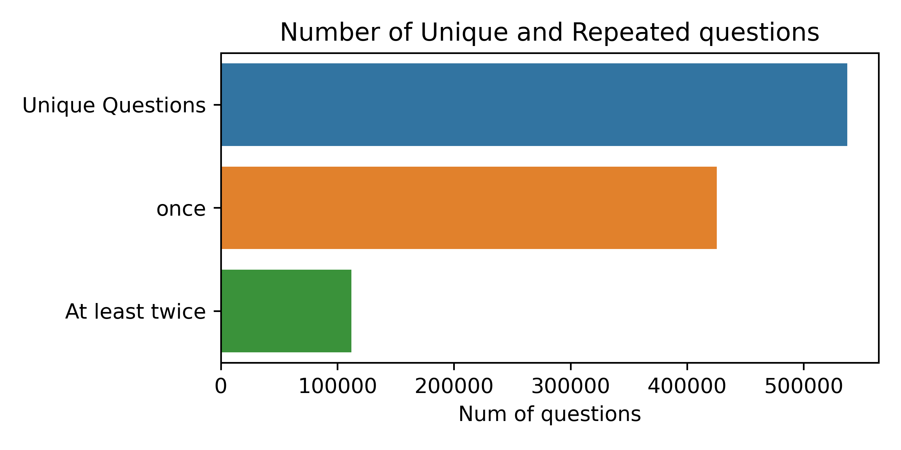
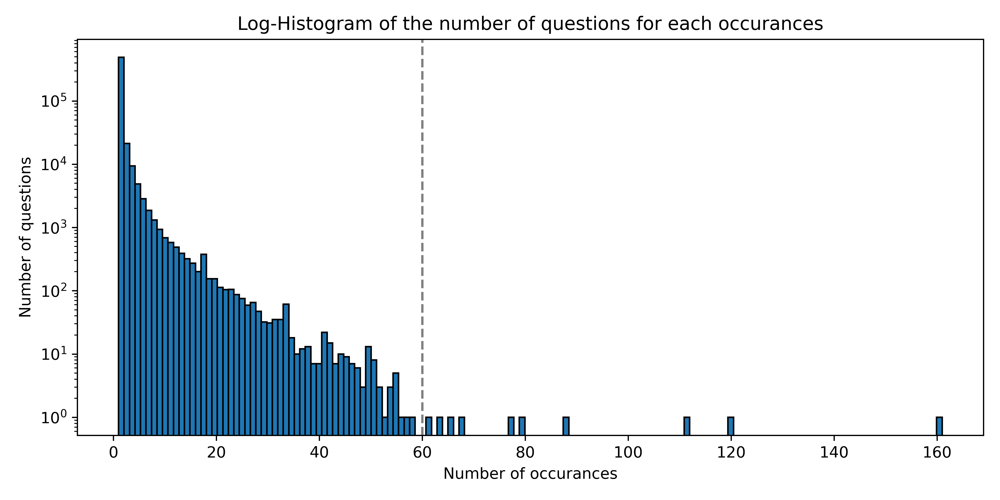
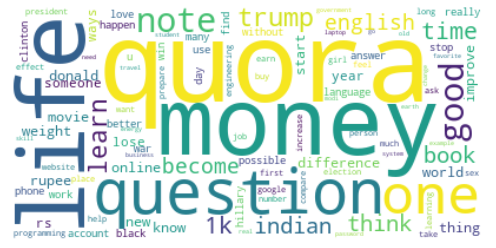

# 1. Introduction
## Background
Nowadays, Quora is known as one of the most popular question-and-answer platforms on the internet. That allows people all over the world to learn from each other and a huge number of people utilize Quora every month indeed.　It is easy to imagine that there are tons of questions similar to each other on the platform. Therefore, it is considered beneficial for all users if there is an algorithm that can identify a new question that is similar to the existing questions on the platform that have already been answered by other users.
## Objective
In this project, we first will implement the Simple Exploratory Data Analysis to understand the dataset. And next, we will go through the process of Text Preprocessing and Feature Engineering to extract some useful features from the dataset. 
Finally, we will implement the Locality Sensitive Hashing algorithm to identify the duplicated questions in the dataset.
And also, we will create the ML model and compare its performance with the LSH algorithm using some indicators such as accuracy, precision, and recall.

# 2. Exploratory Data Analysis

### **The way of visualizing the data in this project**
Since the dataset that we will deal with is text data, we found Tableau to be considerably complicated to utilize for visualization of this data set and decided to use Seaborn and Matplotlib.

## Basic information
First of all, we displayed the data information, shape, and structure by using some appropriate methods in Pandas to better understand the dataset that we have.
The dataset(train.csv) has 404290 rows and 6 columns. The data structure of train.csv is as follows:

| Column Name  | Description                                                         |
| ------------ | ------------------------------------------------------------------- |
| id           | A simple row ID.                                                    |
| qid1, qid2   | The unique ID of each question in the pair.                         |
| question{1,2}| The actual textual contents of the questions.                       |
| is_duplicate | The label is about whether the two questions are duplicates of each other. |

## Missing Data

Next, we investigated whether there were any missing data in the dataset because missing values will have a bad influence on our data analysis. We found that there are three missing data in the dataset. Since we aim to identify the duplication between two pair questions, We decided to drop out these three rows.


## Duplication between two questions

After removing missing values from the dataset, We also examined how many duplicated questions are in the dataset by counting the number of rows in the "is_duplicated" column. We found that there are 149263 duplicated questions out of 404287 in the dataset, which means 37% of the dataset can be considered as duplicated questions.

## Unique questions ＆ Repeated questions

Next, we counted the number of unique questions and repeated questions in the dataset. By combining the two columns ”qid1” and ”qid2” in the dataset, we can count the number of unique questions by using `np.unique()` in Pandas. The total number of unique questions is 537359. 

The number of questions that are repeated more than 1 time is 111870 which is 20.8%, while only once questions are 425489 which is 79.2%. The maximum number of times a question occurs is 161. 


The top 5 most repeated questions are as follows:

|Question                                                     | Frequency 
| ------------------------------------------------------------ | --------- |
| What are the best ways to lose weight?                       | 161       |
| How can you look at someone's private Instagram account without following them? | 120       |
| How can I lose weight quickly?                               | 111       |
| What's the easiest way to make money online?                  | 88        |
| Can you see who views your Instagram?                         | 79        |

## The number of questions for each occurrence
We plotted the logarithm of the number of questions for each occurrence on a logarithmic scale. The majority of the questions in the dataset approximately have occurrences of less than 60. On the other hand, it can be seen that all questions that appear repeatedly more than 60 times are present only once each.




## Word Count in Questions
Next, we examined the distribution of how many words were included in each question. Statistical data, the histogram of the number of words in each question and the Boxplot are shown below. It can be seen that the majority of the questions contain a word count of 1 to 80. It can also be observed that an extremely large number of questions contain only one or two words.


| Statistic| total questions | mean | std | min | 25% | 50% | 75% | max   |
| ---      | ---   | ---  | --- | --- | --- | --- | --- | ---   |
| Value | 808574| 11.1 | 5.9 | 1.0 | 7.0 |10.0 |13.0 | 237.0|


### The maximum number of words in a question
Since the questions that contain the maximum number of words are isolated from the rest of the questions, we further investigated the questions that contain the maximum number of words, which is 237 words. By executing the following code, we found that all the questions that contain the maximum number of words are identical to each other as shown below.

```python
print(total_q[word_counts == max(word_counts)].head())
np.all(
    total_q[word_counts == max(word_counts)].values ==
    total_q[word_counts == max(word_counts)].values[0]
)
```


# 3. Feature Engineering
To have a better understanding of other features behind the dataset, we considered some other features in addition to the given columns. The definition of the new features is as follows:

- word_Common = (The number of unique common unique words in Question 1 and Question 2) = The intersection of the two sets.
  
- word_Total = (Total num of words in Question 1 + Total num of words in Question 2) = The union of the two sets.
- word_share = (word_common)/(word_Total) = The similarity of the two sets.

## Shared words (Similarity between two questions)
The motivation behind these new features is that we can intuitively predict that duplicated questions is likely to have more words in common. In the functions `common_wrd`, we calculated the number of the intersection(common) words between question 1 and question 2 for each row in the dataset. And then in `total`, we calculated the union words in the two sets for each row. To calculate the similarity between the two questions, we divided the number of common words by the number of total words in the two questions by using the function `word_share`. When the two questions are similar, the value of `word_share` will be high. From the following diagram, we can notice that as the word share increases there is a higher chance the questions are similar. From the histogram, we can understand that `word_share` has some information differentiating similar and dissimilar classes. This trend matches the intuition that duplicated questions are highly likely to contain more words in common.


## Word Cloud
### Motivation
We predicted that Duplicated Questions are likely to contain many unique words. In that sense, plotting Word Clouds help us to grasp some important words or features behind the large dataset. 

###  Import Libraries for Word Cloud Visualization
To visualize the word cloud, we imported the WordCloud library with `from wordcloud import WordCloud`, and the` STOPWORDS` (English) library `from wordcloud` because stopwords are considered the most frequent words in English and we wanted to eliminate their effect so that we can focus on more important words, which are not stopwords. 

### Text Preprocessing
In order to visualize the word cloud, we first preprocessed the text data. Furthermore, by going through this process, we can make the text data easier for our machine learning model to interpret the text data. The preprocessing steps are as follows:
- Replace ",000,000" with "m" and ",000" with "k".
- Replace apostrophes with their formal form (e.g., "won't" -> "will not").
- Replace "n't" with "not" (e.g., "can't" -> "can not").
- Replace shortened forms with their formal form (e.g., "what's" -> "what is").
- Replace currency symbols with their respective currency name (e.g., "₹" -> "rupee").
- Remove all non-space symbols.
- Apply "stemming" (e.g., reduce "cats" and "catlike" to "cat").
- Remove HTML tags.

<!-- To visualize the word cloud, we first merged the two questions in each row into one array for both duplicated questions and non-duplicated ones. With `flatten()`, we converted the 3D array into a 1D array. And then the elements stored in each array are taken out one by one and converted to string type. 
All words in the array were combined into a single string. -->

### Result
The preprocessed array and the stopwords to be ignored when visualizing were given to the WordCloud object. The maximum number of words displayed in WordCloud was set to 100 words in order to make it easier to see. Since we noticed that the words {"best","india","will","way","people","make"} are one of the most frequent words for both duplicated and non-duplicated questions, we added them to the stopwords in order to identify the differences between the two cases more clearly.

```python
stopwords = set(STOPWORDS)
my_additional_stopwords = ['best','india','will','way','people','make']
stopwords.update(my_additional_stopwords)
wc = WordCloud(background_color="white", max_words= 100, stopwords=stopwords,collocations=False)
```
Each word cloud for duplicated and non-duplicated questions is shown below.  we can only noticeably see "quora", "money", and "life" in the Duplicated Questions, while "one", "good", and "difference" is in common in the Non-Duplicated Questions. This result is consistent with our intuition that the Duplicated Questions are likely to contain many more specific words than the Non-Duplicated Questions.

#### **Duplicated Questions**


#### **Non-Duplicated Questions**


# 4. Locality-Sensitive Hashing
As mentioned in the introduction, we first implement the Locality Sensitive Hashing(LSH). After LSH, we will move on to the machine learning approach to predict if the two questions are duplicates or not each other.

## Import libraries for LSH
We imported the necessary libraries for LSH as follows:

```python
from nltk.corpus import stopwords
stop_words = set(stopwords.words('english'))
from datasketch import MinHash, MinHashLSH
from tqdm import tqdm
from sklearn.model_selection import train_test_split
```

## Set Representation
In the set representation process, we adopted a word-level shingle instead of a character-level shingle and I set k=1. The reason why I adopted k=1, in this case, is that the probability of finding each shingle in the union of shingles is lower in the second case with k=2. The norm_dict dictionary maps a question to the actual question string. This dictionary can be used to evaluate the results of the MinHashLSH output.

## MinHash signatures
We used MinHash to generate "min hash signatures" for each question in the set_dict dictionary. The signatures will be stored in the min_dict dictionary, which maps each question to its corresponding min hash signature.

## Locality-sensitive hashing
By using Minshashing, we now compressed the questions to numeric representation, and we’ve defined a signature metric. Since we would like to compare questions that are more likely similar to each other rather than comparing two completely different questions with each other, we can use Locality Sensitive Hashing (LSH) to find similar questions in a large set.

## Result
Since increasing the number of  MinHash permutations improves model performance while increasing computational cost, the number of permutations was set to 256. Since the threshold for Similarity is also a tuning parameter as well as the permutation, we investigated how Precision and Recall vary for different thresholds. The best balance between Precision and Recall, which are in a trade-off relationship, can be found at a threshold value of about 0.68. Based on the results of the graph, the best performance for the two indicators can be said to be approximately 30%.

| Threshold | Precision | Recall |
| --------- | --------- | ------ |
| 0.2       | 0.00      | 1.00   |
| 0.3       | 0.01      | 0.90   |
| 0.4       | 0.03      | 0.69   |
| 0.5       | 0.07      | 0.54   |
| 0.6       | 0.21      | 0.36   |
| 0.7       | 0.28      | 0.25   |
| 0.8       | 0.37      | 0.14   |
| 0.9       | 0.36      | 0.07   |


# 5. Machine Learning Model

In order to get a better performance for predicting duplicates, we applied another method based on Machine Learning - XGBoost and we will compare the result with the Hashing method.

## *Data Split*
We first split the original data into training data(70%) and test data(30%).

## *TD-IDF word match*
As we have seen before that the word share feature is strongly correlated to the is_duplicate label, we try to improve this feature, by using TF-IDF (term-frequency-inverse-document-frequency). TD-IDF is a statistical measure for evaluating how important a word is to a document in a collection or corpus. The term frequency (TF) component measures how frequently a term appears in a document, while the inverse document frequency (IDF) component measures how rare or common a term is across all documents in the corpus. Together, these components can be used to score the relevance of a term to a particular document or set of documents. More specificlly, first we count and weigh the words in order to measure how uncommon they are. We care about rare words existing in both questions than common one. For example, if the word "exercise" appears in both questions, they are more likely to be duplicate.

| Most common words | Weights | Least Common words | Weights |
| ----------------- | ------- | ------------------ | ------- |
| the               |3.65e-06 | dcx3400            | 9.99e-05|
| what              |4.21e-06 | 855                | 9.99e-05|
| is                |4.74e-06 | confederates       | 9.99e-05|
|i                  |6.01e-06 | gonulcelen         | 9.99e-05|
|how                |6.07e-06 | asahi              | 9.99e-05| 

And we define TD-IDF word match as the fraction of the weights of shared words between 2 questions over the total weights of 2 questions.
## *Model&Traning*
We use logistic regression to produce the probability of being duplicate and XGboost to optimize the log-loss function.

**Tranining Curve**


## Result
We reach a highest accuracy of 69.37% with a threshold of 0.5, meanwhile the precision is 58.81% and recall is 58.64%. It indicates that our model has some classification ability, but it is not very accurate. Besides, about 40% of the true positive samples were misclassified as negative by the model. And about 40% of our predicted positive samples are not true positive. We can also reach a highest recall with threshold 0.2 and a highest precision with threshold 0.7. When the threshold goes over 0.7, the model predicts no duplicate thus we will have a null value for precision and a 0 for recall.

| Threshold | Precision | Recall | Accuracy |
| --------- | --------- | ------ | -------- |
| 0.2       | 0.49      | 0.98   |  0.62    |
| 0.3       | 0.51      | 0.95   |  0.64    |
| 0.4       | 0.54      | 0.85   |  0.67    |
| 0.5       | 0.59      | 0.58   |  0.69    |
| 0.6       | 0.73      | 0.13   |  0.66    |
| 0.7       | 0.76      | 0.11   |  0.65    |
| 0.8       | ----      | 0.00   |  0.62    |
| 0.9       | ----      | 0.00   |  0.62    |

# 6. Conclusion
The conclusion of this project is as follows:

- The number of questions that are repeated more than 1 time is 20.8% of the total number of questions.
  
- Duplicated questions contain more words in common between question 1 and 2, which matched our intuition.
  
- Duplicated questions have more specific words in the questions compared to Non-Duplicatd questions.

- The best precision and recall of the LSH algorithm is approximately 30%, while when we utilize a machine learning model for identifying the duplications, they are 76% and 98%, respectively., which is 2~3 times better than LSH.